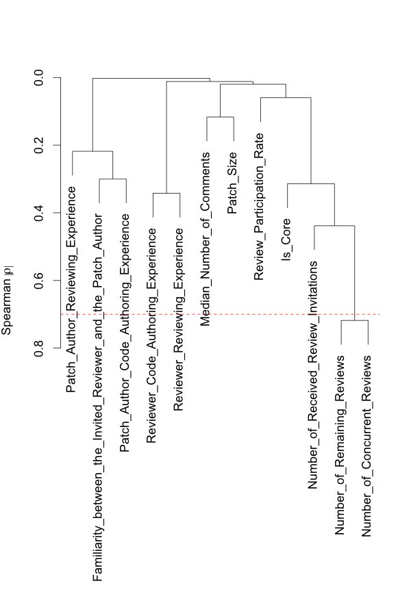
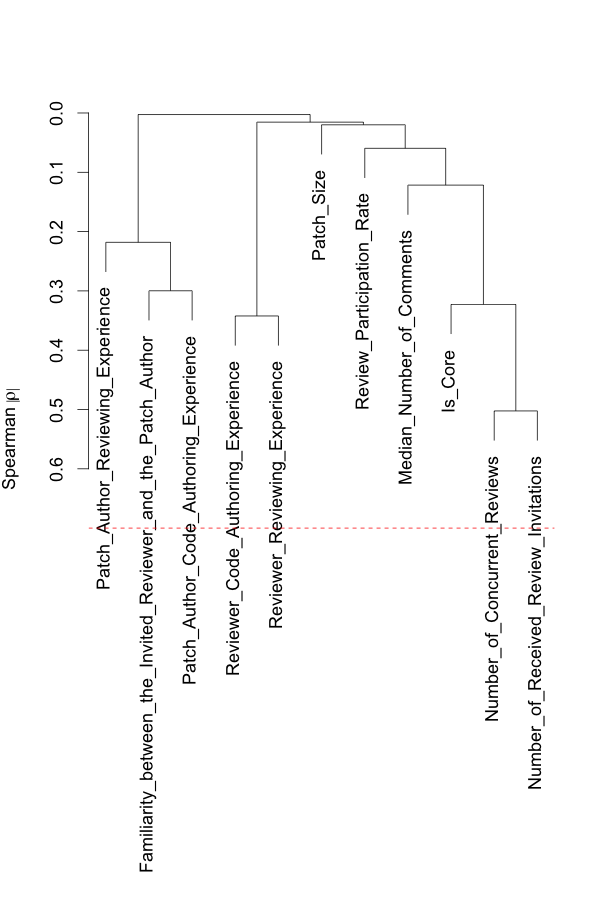

# Replication Package for "The Impact of Human Factors on the Participation Decision of Reviewers in Modern Code Review"
Shade Ruangwan, Patanamon Thongtanunam, Akinori Ihara, and Kenichi Matsumoto

## 1) Bibtex

```bibtex
@article{Ruangwan2017,
    author = {Ruangwan, Shade and Thongtanunam, Patanamon and Ihara, Akinori and Matsumoto, Kenichi},
    title = {The Impact of Human Factors on the Participation Decision of Reviewers in Modern Code Review}
    journal = {Under Major Revision at Empirical Software Engineering}
}
```

## 2) Download Processed Datasets

Each dataset contains 13 studied metrics. Each row also includes review ID and person ID (reviewer ID), and a participation decision of the reviewer (Review_Decision column).

- Android dataset (csv file, ~9 MB)
- OpenStack dataset (csv file, ~32 MB)
- Qt dataset (csv file, ~15 MB)

You can download these datasets [here](https://github.com/sruangwan/replication-human-factors-code-review/releases/latest).

## 3) Additional Results

## 4) Example R Scripts

### 4.1) Install Packages

```R
install.packages("rms")
```

### 4.2) Model Contruction

```R
#Load RMS package
library(rms)
```
The output is:
```
## Loading required package: survival
## Loading required package: Formula
## Loading required package: lattice
## Loading required package: Hmisc
## Loading required package: ggplot2
## 
## Attaching package: ‘Hmisc’
## 
## The following objects are masked from ‘package:base’:
## 
##     format.pval, round.POSIXt, trunc.POSIXt, units
## 
## Loading required package: SparseM
## 
## Attaching package: ‘SparseM’
## 
## The following object is masked from ‘package:base’:
## 
##     backsolve
```
```R
#Load RMS package
df <- read.csv("{PATH_TO_DATASETS}/openstack.csv")

#Set dependent variable
df$y = df$"Review_Decision" == 1

#Select independent variables
ind_vars <- c("Familiarity_between_the_Invited_Reviewer_and_the_Patch_Author", "Median_Number_of_Comments", "Patch_Size", "Reviewer_Code_Authoring_Experience", "Reviewer_Reviewing_Experience", "Number_of_Remaining_Reviews", "Number_of_Concurrent_Reviews", "Review_Participation_Rate", "Number_of_Received_Review_Invitations", "Patch_Author_Code_Authoring_Experience", "Patch_Author_Reviewing_Experience", "Is_Core")

#Set data distribution for RMS package for constructing a model
dd <- datadist(df[,c("y",ind_vars)])
options(datadist = "dd")

```
#### (MC1-a) Remove highly-correlated independent variables
```R
#Calculate spearman's correlation between independent variables
vc <- varclus(~ ., data=df[,ind_vars], trans="abs")

#Plot hierarchical clusters and the spearman's correlation threshold of 0.7
plot(vc)
threshold <- 0.7
abline(h=1-threshold, col = "red", lty = 2)
```

```R
#Remove highly correlated variable from the selected independent variables
reject_vars <- c('Number_of_Remaining_Reviews')
ind_vars <- ind_vars[!(ind_vars %in% reject_vars)]

#Re-calculate spearman's correlation between independent variables
vc <- varclus(~ ., data=df[,ind_vars], trans="abs")

#Re-plot hierarchical clusters and the spearman's correlation threshold of 0.7
plot(vc)
threshold <- 0.7
abline(h=1-threshold, col = "red", lty = 2)
```


#### (MC1-b) Remove redundant independent variables

### 4.3) Model Analysis

```R
```