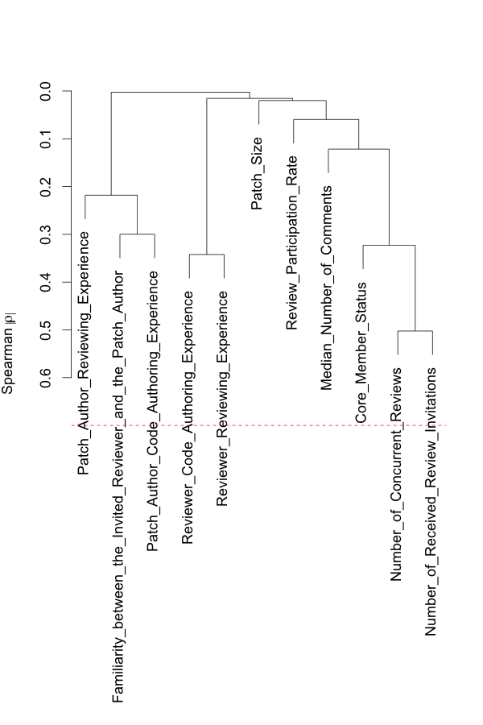

# Replication Package for "The Impact of Human Factors on the Participation Decision of Reviewers in Modern Code Review"
Shade Ruangwan, Patanamon Thongtanunam, Akinori Ihara, and Kenichi Matsumoto

## 1) Bibtex

```bibtex
@article{Ruangwan2017,
    author = {Ruangwan, Shade and Thongtanunam, Patanamon and Ihara, Akinori and Matsumoto, Kenichi},
    title = {The Impact of Human Factors on the Participation Decision of Reviewers in Modern Code Review}
    journal = {Under Major Revision at Empirical Software Engineering}
}
```

## 2) Download Processed Datasets

Each dataset contains 13 studied metrics. Each row also includes review ID and person ID (reviewer ID), and a participation decision of the reviewer (Review_Decision column).

- Android dataset (csv file, ~9 MB)
- OpenStack dataset (csv file, ~32 MB)
- Qt dataset (csv file, ~15 MB)

You can download these datasets [here](https://github.com/sruangwan/replication-human-factors-code-review/releases/latest).

## 3) Additional Results

## 4) Example R Scripts

### 4.1) Install Packages

```R
install.packages("rms")
```

### 4.2) Model Contruction

```R
#Load RMS package
library(rms)
```
The output is:
```
## Loading required package: survival
## Loading required package: Formula
## Loading required package: lattice
## Loading required package: Hmisc
## Loading required package: ggplot2
## 
## Attaching package: ‘Hmisc’
## 
## The following objects are masked from ‘package:base’:
## 
##     format.pval, round.POSIXt, trunc.POSIXt, units
## 
## Loading required package: SparseM
## 
## Attaching package: ‘SparseM’
## 
## The following object is masked from ‘package:base’:
## 
##     backsolve
```
```R
#Load RMS package
df <- read.csv("{PATH_TO_DATASETS}/openstack.csv")

#Set dependent variable
df$y = df$"Review_Decision" == 1

#Select independent variables
ind_vars <- c("Familiarity_between_the_Invited_Reviewer_and_the_Patch_Author", "Median_Number_of_Comments", "Patch_Size", "Reviewer_Code_Authoring_Experience", "Reviewer_Reviewing_Experience", "Number_of_Remaining_Reviews", "Number_of_Concurrent_Reviews", "Review_Participation_Rate", "Number_of_Received_Review_Invitations", "Patch_Author_Code_Authoring_Experience", "Patch_Author_Reviewing_Experience", "Is_Core")

#Set data distribution for RMS package to construct a model
dd <- datadist(df[,c("y",ind_vars)])
options(datadist = "dd")

```
#### (MC1-a) Remove highly-correlated independent variables
```R
#Calculate spearman's correlation between independent variables
vc <- varclus(~ ., data=df[,ind_vars], trans="abs")

#Plot hierarchical clusters and the spearman's correlation threshold of 0.7
plot(vc)
threshold <- 0.7
abline(h=1-threshold, col="red", lty=2)
```

```R
#Remove the highly correlated variable from the selected independent variables
reject_vars <- c('Number_of_Remaining_Reviews')
ind_vars <- ind_vars[!(ind_vars %in% reject_vars)]

#Re-calculate spearman's correlation between independent variables
vc <- varclus(~ ., data=df[,ind_vars], trans="abs")

#Re-plot hierarchical clusters and the spearman's correlation threshold of 0.7
plot(vc)
threshold <- 0.7
abline(h=1-threshold, col="red", lty=2)
```


#### (MC1-b) Remove redundant independent variables
```R
red <- redun(~., data=df[,ind_vars], nk=0) 
print(red)
```
The output is:
```
## Redundancy Analysis
## 
## redun(formula = ~., data = df[, ind_vars], nk = 0)
## 
## n: 466520 	p: 11 	nk: 0 
## 
## Number of NAs:	 0 
## 
## Transformation of target variables forced to be linear
## 
## R-squared cutoff: 0.9 	Type: ordinary 
## 
## R^2 with which each variable can be predicted from all other variables:
## 
## Familiarity_between_the_Invited_Reviewer_and_the_Patch_Author 
##                                                         0.114 
##                                     Median_Number_of_Comments 
##                                                         0.045 
##                                                    Patch_Size 
##                                                         0.001 
##                            Reviewer_Code_Authoring_Experience 
##                                                         0.114 
##                                 Reviewer_Reviewing_Experience 
##                                                         0.138 
##                                  Number_of_Concurrent_Reviews 
##                                                         0.162 
##                                     Review_Participation_Rate 
##                                                         0.035 
##                         Number_of_Received_Review_Invitations 
##                                                         0.253 
##                        Patch_Author_Code_Authoring_Experience 
##                                                         0.141 
##                             Patch_Author_Reviewing_Experience 
##                                                         0.134 
##                                                       Is_Core 
##                                                         0.114 
## 
## No redundant variables
```
```R
#If there are any redundant variables, remove the redundant variables from the selected independent variables
reject_vars <- red$Out
ind_vars <- ind_vars[!(ind_vars %in% reject_vars)]
```
#### (MC2-a) Estimates a budget for degrees of freedom
```R
#Print number of FALSE and TRUE instances
print(table(df$y))
```
The output is:
```
# FALSE   TRUE 
# 44593 421927
```
```R
#Calculate and print the budgeted degrees of freedom
budgeted_df =  budgeted_df = floor(min(nrow(df[df$y == T,]), nrow(df[df$y == F,]) )/15)
print(budgeted_df)
```
The output is:
```
# [1] 2972
```
#### (MC2-b) Measure and plot a dotplot of the Spearman multiple ρ<sup>2</sup> of each independent variable
```R
```
#### (MC2-c) Allocate degrees of freedom based on the Spearman multiple ρ<sup>2</sup> of independent variables and fit a nonlinear logistic regression model using restricted cubic splines
```R
```
### 4.3) Model Analysis

```R
```