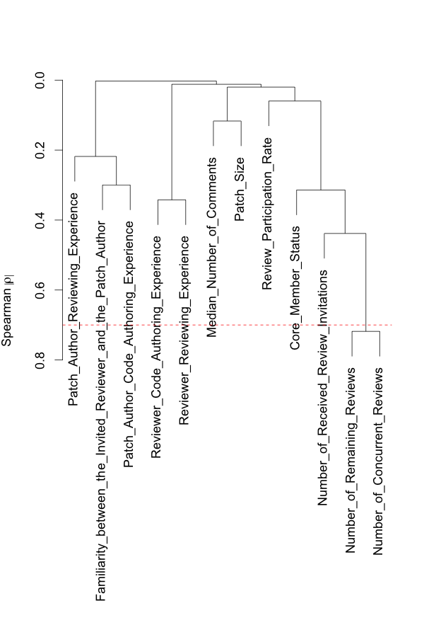

# Replication Package for "The Impact of Human Factors on the Participation Decision of Reviewers in Modern Code Review"
Shade Ruangwan, Patanamon Thongtanunam, Akinori Ihara, and Kenichi Matsumoto

## 1) Bibtex

```bibtex
@article{Ruangwan2017,
    author = {Ruangwan, Shade and Thongtanunam, Patanamon and Ihara, Akinori and Matsumoto, Kenichi},
    title = {The Impact of Human Factors on the Participation Decision of Reviewers in Modern Code Review}
    journal = {Under Major Revision at Empirical Software Engineering}
}
```

## 2) Download Processed Datasets

Each dataset contains 13 studied metrics. Each row also includes review ID and person ID (reviewer ID), and a participation decision of the reviewer (Review_Decision column).

- Android dataset (csv file, ~9 MB)
- LibreOffice dataset (csv file, ~2 MB)
- OpenStack dataset (csv file, ~32 MB)
- Qt dataset (csv file, ~15 MB)

You can download these datasets [here](https://github.com/sruangwan/replication-human-factors-code-review/releases/latest).

## 3) Additional Results

### 3.1) Model Construction
| (Part) Figure                                        | Android                                       | LibreOffice                                       | OpenStack                                       | Qt                                       |
|------------------------------------------------------|-----------------------------------------------|---------------------------------------------------|-------------------------------------------------|------------------------------------------|
| (MC1) Hierarchical clustering                        | [View](figures/varclus/varclus-android.pdf)   | [View](figures/varclus/varclus-libreoffice.pdf)   | [View](figures/varclus/varclus-openstack.pdf)   | [View](figures/varclus/varclus-qt.pdf)   |
| (MC2) Dotplot of the Spearman multiple ρ<sup>2</sup> | [View](figures/spearman/spearman-android.pdf) | [View](figures/spearman/spearman-libreoffice.pdf) | [View](figures/spearman/spearman-openstack.pdf) | [View](figures/spearman/spearman-qt.pdf) |

### 3.2) Model Analysis
| Relationship Figure                                                 | Android                                                              | LibreOffice                                                              | OpenStack                                                              | Qt                                                              |
|---------------------------------------------------------------------|----------------------------------------------------------------------|--------------------------------------------------------------------------|------------------------------------------------------------------------|-----------------------------------------------------------------|
| Review Participation Rate of an Invited Reviewer and the Likelihood | [View](figures/relationship/participation-rate-android.pdf)          | [View](figures/relationship/participation-rate-libreoffice.pdf)          | [View](figures/relationship/participation-rate-openstack.pdf)          | [View](figures/relationship/participation-rate-qt.pdf)          |
| Code Authoring Experience of an Invited Reviewer and the Likelihood | [View](figures/relationship/reviewer-code-authoring-exp-android.pdf) | [View](figures/relationship/reviewer-code-authoring-exp-libreoffice.pdf) | [View](figures/relationship/reviewer-code-authoring-exp-openstack.pdf) | [View](figures/relationship/reviewer-code-authoring-exp-qt.pdf) |

## 4) Example R Scripts

### 4.1) Install Packages

```R
#For the model construction and analysis process
install.packages("rms")

#For the model analysis process
install.packages("doParallel")
install.packages("pROC")
install.packages("caret")
install.packages("ScottKnottESD")
```

### 4.2) Model Contruction

```R
#Load RMS package
library(rms)
```
The output is:
```
## Loading required package: survival
## Loading required package: Formula
## Loading required package: lattice
## Loading required package: Hmisc
## Loading required package: ggplot2
## 
## Attaching package: ‘Hmisc’
## 
## The following objects are masked from ‘package:base’:
## 
##     format.pval, round.POSIXt, trunc.POSIXt, units
## 
## Loading required package: SparseM
## 
## Attaching package: ‘SparseM’
## 
## The following object is masked from ‘package:base’:
## 
##     backsolve
```
```R
#Load OpenStack dataset
df <- read.csv("{PATH_TO_DATASETS}/openstack.csv")

#Set dependent variable
df$y = df$"Review_Decision" == 1
dep <- c("y")

#Select independent variables
ind_vars <- c("Familiarity_between_the_Invited_Reviewer_and_the_Patch_Author", "Median_Number_of_Comments", "Patch_Size", "Reviewer_Code_Authoring_Experience", "Reviewer_Reviewing_Experience", "Number_of_Remaining_Reviews", "Number_of_Concurrent_Reviews", "Review_Participation_Rate", "Number_of_Received_Review_Invitations", "Patch_Author_Code_Authoring_Experience", "Patch_Author_Reviewing_Experience", "Core_Member_Status")

#Set data distribution for RMS package to construct a model
dd <- datadist(df[,c("y",ind_vars)])
options(datadist = "dd")

```
#### (MC1-a) Remove highly-correlated independent variables
```R
#Calculate spearman's correlation between independent variables
vc <- varclus(~ ., data=df[,ind_vars], trans="abs")

#Plot hierarchical clusters and the spearman's correlation threshold of 0.7
plot(vc)
threshold <- 0.7
abline(h=1-threshold, col="red", lty=2)
```

```R
#Remove the highly correlated variable from the selected independent variables
reject_vars <- c('Number_of_Remaining_Reviews')
ind_vars <- ind_vars[!(ind_vars %in% reject_vars)]

#Re-calculate spearman's correlation between independent variables
vc <- varclus(~ ., data=df[,ind_vars], trans="abs")

#Re-plot hierarchical clusters and the spearman's correlation threshold of 0.7
plot(vc)
threshold <- 0.7
abline(h=1-threshold, col="red", lty=2)
```


#### (MC1-b) Remove redundant independent variables
```R
red <- redun(~., data=df[,ind_vars], nk=0) 
print(red)
```
The output is:
```
## Redundancy Analysis
## 
## redun(formula = ~., data = df[, ind_vars], nk = 0)
## 
## n: 466520 	p: 11 	nk: 0 
## 
## Number of NAs:	 0 
## 
## Transformation of target variables forced to be linear
## 
## R-squared cutoff: 0.9 	Type: ordinary 
## 
## R^2 with which each variable can be predicted from all other variables:
## 
## Familiarity_between_the_Invited_Reviewer_and_the_Patch_Author 
##                                                         0.114 
##                                     Median_Number_of_Comments 
##                                                         0.045 
##                                                    Patch_Size 
##                                                         0.001 
##                            Reviewer_Code_Authoring_Experience 
##                                                         0.114 
##                                 Reviewer_Reviewing_Experience 
##                                                         0.138 
##                                  Number_of_Concurrent_Reviews 
##                                                         0.162 
##                                     Review_Participation_Rate 
##                                                         0.035 
##                         Number_of_Received_Review_Invitations 
##                                                         0.253 
##                        Patch_Author_Code_Authoring_Experience 
##                                                         0.141 
##                             Patch_Author_Reviewing_Experience 
##                                                         0.134 
##                                            Core_Member_Status 
##                                                         0.114 
## 
## No redundant variables
```
```R
#If there are any redundant variables, remove the redundant variables from the selected independent variables
reject_vars <- red$Out
ind_vars <- ind_vars[!(ind_vars %in% reject_vars)]
```
#### (MC2-a) Estimates a budget for degrees of freedom
```R
#Print number of FALSE and TRUE instances
print(table(df$y))
```
The output is:
```
# FALSE   TRUE 
# 44593 421927
```
```R
#Calculate and print the budgeted degrees of freedom
budgeted_df =  budgeted_df = floor(min(nrow(df[df$y == T,]), nrow(df[df$y == F,]) )/15)
print(budgeted_df)
```
The output is:
```
# [1] 2972
```
#### (MC2-b) Measure and plot a dotplot of the Spearman multiple ρ<sup>2</sup> of each independent variable
```R
sp <- spearman2(formula(paste("Review_Decision" ," ~ ",paste0(ind_vars, collapse=" + "))), data= df, p=2)
plot(sp)
```

#### (MC2-c) Allocate degrees of freedom based on the Spearman multiple ρ<sup>2</sup> of independent variables and fit a nonlinear logistic regression model using restricted cubic splines with original dataset
```R
model <- lrm(y ~ Familiarity_between_the_Invited_Reviewer_and_the_Patch_Author + Median_Number_of_Comments + Patch_Size + Reviewer_Code_Authoring_Experience + Reviewer_Reviewing_Experience + Number_of_Concurrent_Reviews + rcs(Review_Participation_Rate, 3) + Number_of_Received_Review_Invitations + Patch_Author_Code_Authoring_Experience + Patch_Author_Reviewing_Experience + Core_Member_Status, data=df, x=T, y=T)
```
### 4.3) Model Analysis

#### (MA1) Evaluate the performance of the nonlinear logistic regression model
```R
#Load doParallel package
library(doParallel)
```
The output is:
```
## Loading required package: foreach
## foreach: simple, scalable parallel programming from Revolution Analytics
## Use Revolution R for scalability, fault tolerance and more.
## http://www.revolutionanalytics.com
## Loading required package: iterators
## Loading required package: parallel
```
```R
#Select the number of cores to use for parallel execution
#The example uses 4 cores
cl <- makeCluster(4)
registerDoParallel(cl)

#Define a function to use for combining outputs of the parallel execution
comb <- function(...) {
    mapply(rbind, ..., SIMPLIFY=FALSE)
}

#Run the parallel process with 1,000 iterations of foreach with the `comb` combination function
bootstrap_output <- foreach(i=1:1000, .combine='comb', .multicombine=TRUE) %dopar% {
    #Set seed so the results are reproducible
    set.seed(i)

    #Load library for each parallel process
    library(rms)
    library(pROC)
    library(caret)

    #Randomly draw a bootstrap sample with replacement from the original dataset and put it in `training`
    #This will be a training dataset for the nonlinear logistic regression model
    indices <- sample(nrow(df), replace=TRUE)
    training <- df[indices,]

    #Put other instances that are not in `training` to `testing`
    #This will be a testing dataset for the nonlinear logistic regression
    testing <- df[-unique(indices),]

    #Fit a nonlinear logistic regression model using the same allocated degrees of freedom as MC3-c using the training dataset
    m <- lrm(y ~ Familiarity_between_the_Invited_Reviewer_and_the_Patch_Author + Median_Number_of_Comments + Patch_Size + Reviewer_Code_Authoring_Experience + Reviewer_Reviewing_Experience + Number_of_Concurrent_Reviews + rcs(Review_Participation_Rate, 3) + Number_of_Received_Review_Invitations + Patch_Author_Code_Authoring_Experience + Patch_Author_Reviewing_Experience + Core_Member_Status, data=training, x=T, y=T)
    
    #Calculate Precision, Recall, and F-measure 
    prob <- rms:::predict.lrm(m, testing, type='fitted')
    confMatrix <- caret:::confusionMatrix(table(ifelse(prob > 0.5, 1, 0), testing$Review_Decision))
    precision <- confMatrix$byClass[['Precision']]
    recall <- confMatrix$byClass[['Recall']]
    Fmeasure <- 2 * ((precision * recall) / (precision + recall))

    #Calculate area under the ROC curve (AUC)
    auc <- auc(testing[,dep],prob)

    #Calculate Brier score
    brier <- mean((prob-testing$Review_Decision)^2)

    #Combine the performance estimates as an output of single iteration
    cbind(recall, precision, Fmeasure, auc, brier)
}
```
You can download the performance estimates [here](https://github.com/sruangwan/replication-human-factors-code-review/releases/latest).

#### (MA2-a) Estimate the power of explanatory
The first part of the example script is the same as MA1 until the line where we fit a model. We seperate the script for the purpose of clarification. However, MA1 and MA2 can be combined and executed at the same time.
```R
#Load doParallel package
library(doParallel)
```
The output is:
```
## Loading required package: foreach
## foreach: simple, scalable parallel programming from Revolution Analytics
## Use Revolution R for scalability, fault tolerance and more.
## http://www.revolutionanalytics.com
## Loading required package: iterators
## Loading required package: parallel
```
```R
#Select the number of cores to use for parallel execution
#The example uses 4 cores
cl <- makeCluster(4)
registerDoParallel(cl)

#Define a function to use for combining outputs of the parallel execution
comb <- function(...) {
    mapply(rbind, ..., SIMPLIFY=FALSE)
}

#Run the parallel process with 1,000 iterations of foreach with the `comb` combination function
bootstrap_output <- foreach(i=1:1000, .combine='comb', .multicombine=TRUE) %dopar% {
    #Set seed so the results are reproducible
    set.seed(i)

    #Load library for each parallel process
    library(rms)
    library(pROC)
    library(caret)

    #Randomly draw a bootstrap sample with replacement from the original dataset and put it in `training`
    #This will be a training dataset for the nonlinear logistic regression model
    indices <- sample(nrow(df), replace=TRUE)
    training <- df[indices,]

    #Put other instances that are not in `training` to `testing`
    #This will be a testing dataset for the nonlinear logistic regression
    testing <- df[-unique(indices),]

    #Fit a nonlinear logistic regression model using the same allocated degrees of freedom as MC3-c using the training dataset
    m <- lrm(y ~ Familiarity_between_the_Invited_Reviewer_and_the_Patch_Author + Median_Number_of_Comments + Patch_Size + Reviewer_Code_Authoring_Experience + Reviewer_Reviewing_Experience + Number_of_Concurrent_Reviews + rcs(Review_Participation_Rate, 3) + Number_of_Received_Review_Invitations + Patch_Author_Code_Authoring_Experience + Patch_Author_Reviewing_Experience + Core_Member_Status, data=training, x=T, y=T)
    
    #Estimate the power of explanatory (Wald χ2) of each variable with its statistical significance (p-value)
    explantory_power <- anova(m, test='Chisq')
    ep_df <- as.data.frame(explantory_power)
    chisq <- t(ep_df["Chi-Square"])
    pvalue <- t(ep_df["P"])

    #Combine the power of explanatory and the statistical significance as an output of single iteration
    cbind(chisq, pvalue)
}
```
You can download the power of explanatory and the statistical significance [here](https://github.com/sruangwan/replication-human-factors-code-review/releases/latest).

#### (MA2-b) Determine ranks of explanatory power of the variables using Scott-Knott Effect Size Difference (ESD) test
```R
#Load ScottKnottESD package
library("ScottKnottESD")
```
The output is:
```
## Loading required package: reshape2
## Loading required package: effsize
## Loading required package: car
## 
## Attaching package: ‘car’
## 
## The following object is masked from ‘package:rms’:
## 
##     vif
```
```R
#Load the power of explanatory data
wald <- read.csv("{PATH_TO_RESULTS}/openstack-wald.csv")

#Calculate and show the rank of explanatory power
rank <- sk_esd(wald)
print(rank$groups)
```
The output is:
```
##                                     Review_Participation_Rate 
##                                                             1 
##                            Reviewer_Code_Authoring_Experience 
##                                                             2 
##                             Patch_Author_Reviewing_Experience 
##                                                             3 
##                        Patch_Author_Code_Authoring_Experience 
##                                                             4 
##                                 Reviewer_Reviewing_Experience 
##                                                             5 
##                                     Median_Number_of_Comments 
##                                                             6 
## Familiarity_between_the_Invited_Reviewer_and_the_Patch_Author 
##                                                             7 
##                                  Number_of_Concurrent_Reviews 
##                                                             8 
##                                            Core_Member_Status 
##                                                             9 
##                         Number_of_Received_Review_Invitations 
##                                                            10 
##                                                    Patch_Size 
##                                                            11 
```

#### (MA3) Examine the relationships between the variables and the participation decision
Note that the model in this part is trained using the original dataset (a continuation from MC2-c).
```R
predict <- Predict(model, Review_Participation_Rate, fun=function(x) 1/(1+exp(-x)))
plot(predict)
```


Estimate the partial effect
```R
partial_effect = summary(model)
print(partial_effect)
```
The output is:
```
##             Effects              Response : y 
##
## Factor                                                        Low       High       Diff.      Effect      S.E.       Lower 0.95  Upper 0.95 
## Familiarity_between_the_Invited_Reviewer_and_the_Patch_Author  0.000000   6.000000   6.000000  0.02107500 2.7146e-03  1.5754e-02  0.02639500
##  Odds Ratio                                                    0.000000   6.000000   6.000000  1.02130000         NA  1.0159e+00  1.02670000
## Median_Number_of_Comments                                      1.000000   2.000000   1.000000  0.03213200 3.8081e-03  2.4668e-02  0.03959500
##  Odds Ratio                                                    1.000000   2.000000   1.000000  1.03270000         NA  1.0250e+00  1.04040000
## Patch_Size                                                    13.000000 489.000000 476.000000  0.00001133 5.2224e-05 -9.1027e-05  0.00011369
##  Odds Ratio                                                   13.000000 489.000000 476.000000  1.00000000         NA  9.9991e-01  1.00010000
## Reviewer_Code_Authoring_Experience                             0.000000   0.082798   0.082798  0.15397000 4.5433e-03  1.4507e-01  0.16288000
##  Odds Ratio                                                    0.000000   0.082798   0.082798  1.16650000         NA  1.1561e+00  1.17690000
## Reviewer_Reviewing_Experience                                  0.000000   1.000000   1.000000  1.59440000 1.3511e-01  1.3296e+00  1.85920000
##  Odds Ratio                                                    0.000000   1.000000   1.000000  4.92520000         NA  3.7794e+00  6.41840000
## Number_of_Concurrent_Reviews                                  12.000000 103.000000  91.000000 -0.01061300 2.7813e-03 -1.6064e-02 -0.00516180
##  Odds Ratio                                                   12.000000 103.000000  91.000000  0.98944000         NA  9.8406e-01  0.99485000
## Review_Participation_Rate                                      0.913870   1.000000   0.086133  4.35120000 5.4364e-02  4.2446e+00  4.45770000
##  Odds Ratio                                                    0.913870   1.000000   0.086133 77.57100000         NA  6.9731e+01 86.29200000
## Number_of_Received_Review_Invitations                         19.000000 382.000000 363.000000 -0.00036466 4.5986e-03 -9.3778e-03  0.00864850
##  Odds Ratio                                                   19.000000 382.000000 363.000000  0.99964000         NA  9.9067e-01  1.00870000
## Patch_Author_Code_Authoring_Experience                         0.015663   0.267260   0.251600 -0.08877900 5.2954e-03 -9.9157e-02 -0.07840000
##  Odds Ratio                                                    0.015663   0.267260   0.251600  0.91505000         NA  9.0560e-01  0.92459000
## Patch_Author_Reviewing_Experience                              0.000000   1.000000   1.000000 -2.28560000 8.8233e-02 -2.4586e+00 -2.11270000
##  Odds Ratio                                                    0.000000   1.000000   1.000000  0.10171000         NA  8.5557e-02  0.12091000
## Core_Member_Status                                             0.000000   1.000000   1.000000 -0.03688000 1.3688e-02 -6.3708e-02 -0.01005200
##  Odds Ratio                                                    0.000000   1.000000   1.000000  0.96379000         NA  9.3828e-01  0.99000000
```

### 4.4) Retrieve Developers Email Address
We use [REST API](https://gerrit-review.googlesource.com/Documentation/rest-api.html) provided by Gerrit to retrieve developers email address.
Below, we provide the example retrieval script of OpenStack written in ```Python 2.7```. We use [Pygerrit2](https://github.com/dpursehouse/pygerrit2) library as an interface to interact with Gerrit via REST API.
```python
# Load Pygerrit2 library
from requests.auth import HTTPDigestAuth
from pygerrit.rest import GerritRestAPI

# To delay between each API request
import time

# To output email address to csv file
import csv

# Set the URL of Gerrit
auth = None
rest = GerritRestAPI(url='https://review.openstack.org', auth=auth)

for developer_id in developer_list:
    # Get account info (JSON format) from Gerrit
    account_info = rest.get("/accounts/"+str(developer_id))

    # Retrieve developer fullname from the downloaded JSON
    developer_fullname = account_info['name']

    # Retrieve email address from the downloaded JSON
    developer_email = account_info['email']

    # Output to csv file
    with open("output.csv", 'a') as csvfile:
        wr = csv.writer(csvfile, dialect='excel')
        wr.writerow((developer_fullname, developer_email))

    # Wait 1 second
    time.sleep(1)

```

